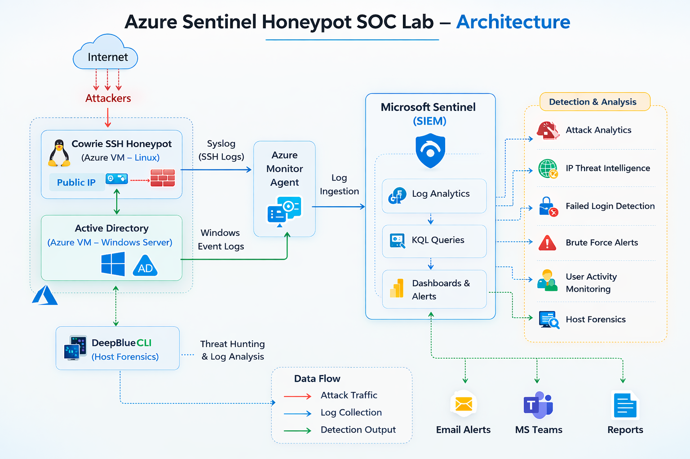
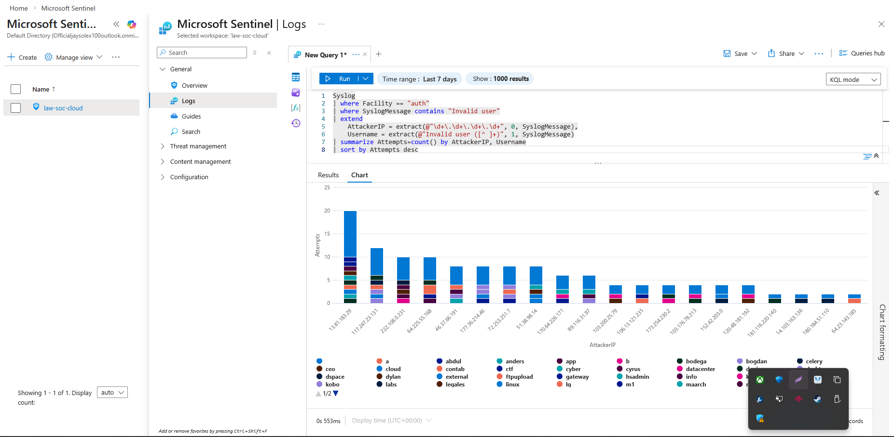
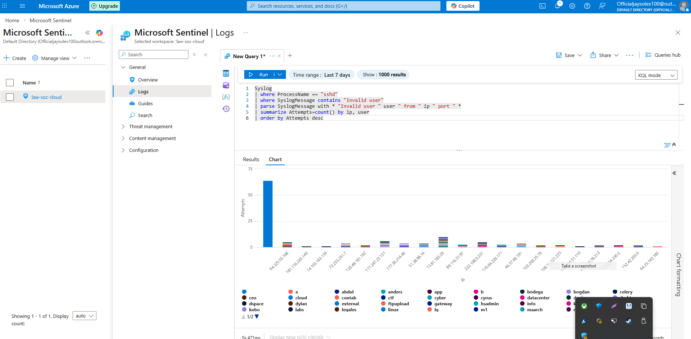
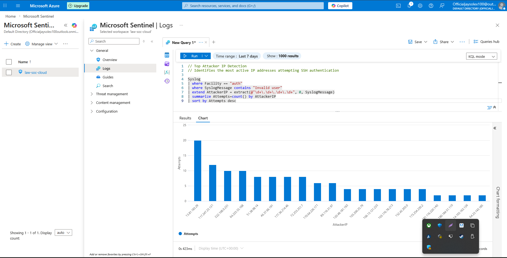
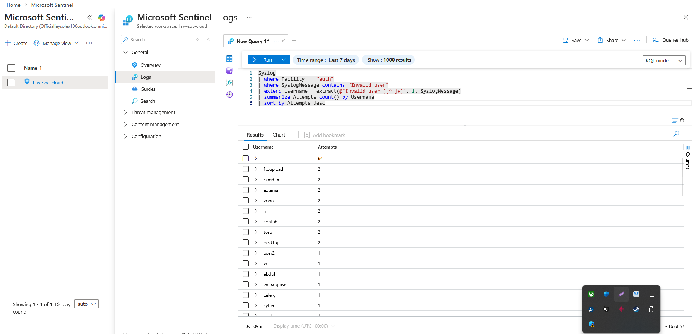
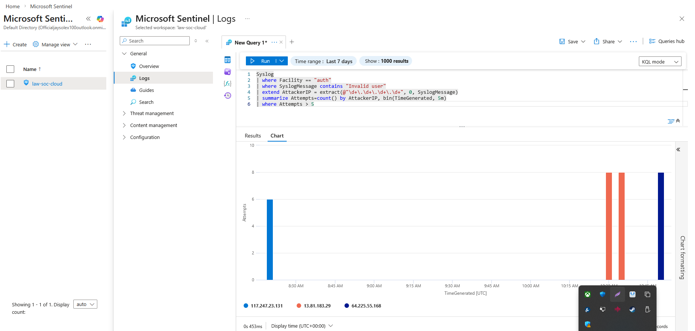
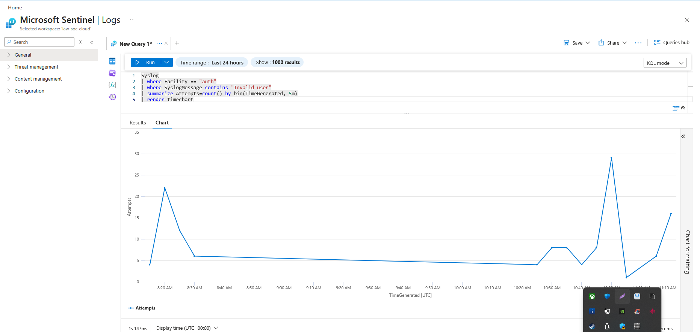

# Azure-Sentinel-Honeypot-SOC-Lab

End-to-end **cloud SOC detection lab** using a Cowrie SSH honeypot deployed in Microsoft Azure and integrated with **Microsoft Sentinel SIEM** to detect brute-force authentication attempts, attacker reconnaissance activity, credential harvesting, and suspicious login patterns using **KQL threat hunting queries** and **Windows security log analysis**.

---

# Objective

This project demonstrates a **real-world SOC detection workflow**:

- Deploy a public-facing honeypot in Azure  
- Capture real-world SSH attack traffic  
- Ingest Linux Syslog logs into Microsoft Sentinel  
- Perform threat hunting using KQL queries  
- Detect SSH brute-force authentication attempts  
- Identify attacker IP addresses and targeted usernames  
- Analyze authentication patterns and attack timelines  
- Monitor Windows Active Directory security events  
- Use DeepBlueCLI to detect suspicious Windows activity  
- Investigate attacker infrastructure using threat intelligence  
- Map detections to MITRE ATT&CK techniques  

---

# Cloud SOC Architecture

This lab simulates a **cloud SOC monitoring environment** combining honeypot telemetry with SIEM detection.




---

# Example Sentinel Detection Query

The following KQL query was used in Microsoft Sentinel to detect **SSH brute-force authentication attempts** captured by the Cowrie honeypot.

The query extracts:

- Attacker IP addresses
- Targeted usernames
- Number of authentication attempts

This allows SOC analysts to quickly identify **active brute-force sources and targeted accounts**.

query:  [`queries/sentinel-kql-queries.kql`](queries/SSH-auth-brutfrorce-attemp.kql)

```kql
Syslog
| where Facility == "auth"
| where SyslogMessage contains "Invalid user"
| extend
    AttackerIP = extract(@"\d+\.\d+\.\d+\.\d+", 0, SyslogMessage),
    Username = extract(@"Invalid user ([^ ]+)", 1, SyslogMessage)
| summarize Attempts=count() by AttackerIP, Username
| sort by Attempts desc
```



# Data Flow Explanation

Internet attackers scan public cloud infrastructure.

The Azure VM receives inbound SSH traffic on **port 22**.

iptables redirects traffic to the **Cowrie SSH honeypot running on port 2222**.

Cowrie logs attacker activity including:

- SSH connections  
- Authentication attempts  
- Client fingerprints  
- Executed commands  

Linux Syslog forwards logs to:

- Azure Monitor Agent

Logs are ingested into:

- Log Analytics Workspace

Microsoft Sentinel performs:

- Threat hunting  
- Detection queries  
- Attack investigation  

---

# Detection Walkthrough

## 1️⃣ SSH Brute Force Detection

Query: [`queries/sentinel-kql-queries.kql`](queries/ssh_bruteforce_detection.kql)

Detects repeated authentication attempts against the honeypot.

```kql
Syslog
| where ProcessName == "sshd"
| where SyslogMessage contains "Invalid user"
| parse SyslogMessage with * "Invalid user " user " from " ip " port " *
| summarize Attempts=count() by ip, user
| order by Attempts desc
```

MITRE: T1110 – Brute Force

2️⃣ Top Attacker IP Detection

Query: [`queries/top_attacker_ips.kql`](queries/top_attacker_ips.kql)

Identifies the most active attacking IP addresses.

```kql
Syslog
| where Facility == "auth"
| where SyslogMessage contains "Invalid user"
| extend AttackerIP = extract(@"\d+\.\d+\.\d+\.\d+", 0, SyslogMessage)
| summarize Attempts=count() by AttackerIP
| sort by Attempts desc
```

📸 Screenshot


SSH Attack Detection

3️⃣ Targeted Username Enumeration

query: [`targeted_usernames.kql`](queries/targeted_usernames.kql)

Identifies usernames attackers attempt to brute force.

```kql
Syslog
| where Facility == "auth"
| where SyslogMessage contains "Invalid user"
| extend Username = extract(@"Invalid user ([^ ]+)", 1, SyslogMessage)
| summarize Attempts=count() by Username
| sort by Attempts desc
```

Attackers commonly probe for:

Admin accounts

Service accounts

Development accounts

4️⃣ Brute Force Behavior Detection

query: [`high-frequency-auth-attempt.kql`](queries/high-frequency-auth-attempt.kql)

Detects high-frequency authentication attempts from a single source.

```kql
Syslog
| where Facility == "auth"
| where SyslogMessage contains "Invalid user"
| extend AttackerIP = extract(@"\d+\.\d+\.\d+\.\d+", 0, SyslogMessage)
| summarize Attempts=count() by AttackerIP, bin(TimeGenerated, 5m)
| where Attempts > 5
```


MITRE: T1110 – Brute Force

5️⃣ Attack Timeline Visualization

query: [`attack-timeline-visualization`](queries/attack_timeline.kql)

Displays attack frequency over time.

```kql
Syslog
| where Facility == "auth"
| where SyslogMessage contains "Invalid user"
| summarize Attempts=count() by bin(TimeGenerated, 5m)
| render timechart
```


This allows SOC analysts to visualize attack spikes and automated scanning behavior

Active Directory Monitoring

A Windows Server 2025 Domain Controller was deployed to simulate enterprise authentication activity.

Security events were collected and analyzed using DeepBlueCLI and PowerShell event analysis.

Results:

```
EventID Count Description
4625    2077  Failed Logon Attempt
4624    1414  Successful Logon
4672    1375  Special Privileges Assigned
4648      48  Explicit Credential Logon
```

Screenshot:

Honeypot Deployment
Clone Cowrie Repository

```
git clone https://github.com/cowrie/cowrie.git
cd cowrie
```
Create Python Virtual Environment

```bash
python3 -m venv cowrie-env
source cowrie-env/bin/activate
```

Install Dependencies
```
pip install -r requirements.txt
```

Configure Cowrie
```bash
cp etc/cowrie.cfg.dist etc/cowrie.cfg
```

Start Honeypot
```
python -m twisted cowrie
```

Cowrie listens on:

```
Port 2222
```

Redirect SSH Traffic to Honeypot
```
sudo iptables -t nat -A PREROUTING -p tcp --dport 22 -j REDIRECT --to-port 2222
```

This ensures attackers interacting with port 22 connect to the honeypot instead of the real SSH service.

Threat Intelligence Investigation


Example attacker IP investigated:
```
13.81.183.29
```
ASN:
```
AS8075 – Microsoft Corporation
```
Security intelligence platforms reported 933 attack events associated with this IP.

Security vendors flagging this IP include:

GreyNoise

CriminalIP

CyRadar

MalwareURL

Guardpot

Although the IP belongs to Microsoft Azure, cloud infrastructure is frequently abused by attackers due to:

Disposable virtual machines

Rapidly rotating IP addresses

Global infrastructure access

Indicators of Compromise

Captured attacker IP addresses:
```
64.225.55.168
51.38.98.14
177.36.214.46
46.37.66.191
72.253.251.7
170.64.226.171
89.116.31.97
152.42.203.0
103.200.25.79
13.81.183.29
```
Screenshots
Honeypot Attack Logs

Sentinel Agent Heartbeat

SSH Attack Detection

DeepBlueCLI Threat Analysis

MITRE ATT&CK Mapping
| Behavior          | Technique |
| ----------------- | --------- |
| SSH Brute Force   | T1110     |
| Credential Access | T1110     |
| Valid Account Use | T1078     |
| Remote Services   | T1021     |
| Command Execution | T1059     |
Cloud Security Engineering

Honeypot Deployment

Linux Server Administration

Threat Intelligence Collection

SOC Threat Hunting

SIEM Integration

KQL Detection Engineering

Windows Security Log Analysis

Tools Used

Microsoft Azure

Microsoft Sentinel

Cowrie SSH Honeypot

Azure Monitor Agent

Log Analytics Workspace

DeepBlueCLI

PowerShell

KQL (Kusto Query Language)

Project Outcome

This lab demonstrates the ability to:

Deploy a cloud honeypot environment

Capture real attacker activity from the internet

Ingest security telemetry into Microsoft Sentinel

Detect brute-force authentication attempts

Perform threat hunting using KQL queries

Analyze attacker infrastructure using threat intelligence

Build SOC-style detection workflows for real-world attacks


